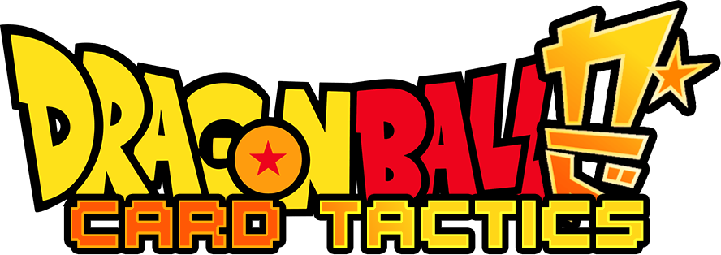

# Dragon Ball Omega Tactics

<div align="center">
  
</div>

## What is *Dragon Ball Omega Tactics*?

*Dragon Ball Omega Tactics* is a strategy game that combines hero management and tactical combat inspired by chess. Players can recruit and develop iconic heroes, manage their abilities, and engage in grid-based battles where strategic positioning and planning are key to victory. This unique blend of gameplay offers fans of the genre and the *Dragon Ball* universe an engaging and challenging experience.

---

## Development Requirements

To develop or run *Dragon Ball Omega Tactics*, you'll need:

- **Unity Editor Version**: 6000.0.23f1  
  Ensure this specific version of Unity is installed to maintain compatibility with the project's files and dependencies.

### Setting Up the Project

1. Install Unity 6000.0.23f1 from the [Unity Hub](https://unity.com/download).
2. Clone this repository:
```bash
git clone https://github.com/EthanCarollo/dragon-ball-omega-tactics.git
```
3. Open the project in Unity:
   - Launch Unity Hub and select **Open Project**.
   - Navigate to the cloned repository folder and click **Open**.
4. Press **Play** in the Unity Editor to test the game.

### Additional Notes

- Ensure all external assets are properly imported and configured as outlined in the project documentation.
- Use Unity's built-in package manager to resolve any missing dependencies.

### Disclaimer

This game is a fan-made project based on the Dragon Ball franchise, which is owned by Toei Animation, Shueisha, and Akira Toriyama. I do not own any rights to the characters, story, or any other intellectual property associated with Dragon Ball.

This project is created for non-commercial, fan appreciation purposes only. It is not endorsed, approved, or affiliated with the official Dragon Ball creators.

If requested by the copyright holders, I will remove or modify the game accordingly.

